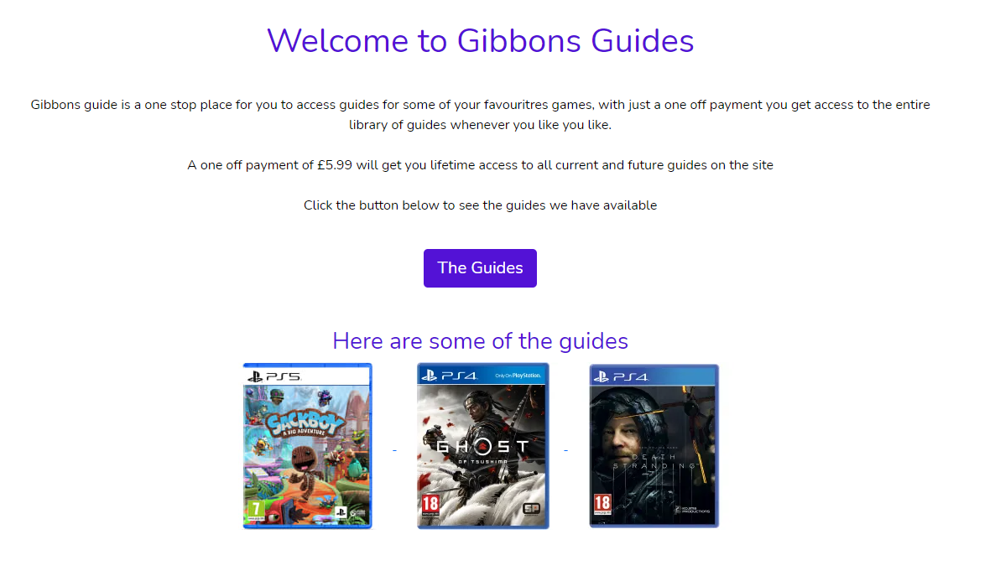

# Gibbons Guides

This project is designed to be a webstore for anyone that wants guides to some of their favourite computer guides, users can login and pay a one off fee to get access to the guides forever.

## UX

Design
It has been designed to be simple to use but still pleasing to the user, features should be easy to reach and nothing should be more than a few clicks away

Colours
When coming up with the colours I decided on using white/black/pusple(#5312d6). The choice was made to not clash with the most recognisible colours in gaming (Playstation - Blue, Xbox - Red, Nintendo - Red). By chosing a colour that did not show a brand bias it should show users notice that multiple platforms are supported and not just focusing on one.

Wireframes
Wireframes were designed using Miro, they can be found here
[Wireframes](https://miro.com/app/board/o9J_l34w-Cg=/)

## User stories

User
1. See quickly what the site is about from the main page
2. Navigate throughout site easier and intuitively
3. See a full list of guides available easily if needed
4. Search and filter guides the guides to find a certain guide or platform
5. See info about specific guides
6. Purchase a membership easily
7. See a profile page that confirms membership status

Owner
1. Perform CRUD on guides
2. Use site elements to encourage sign up
3. Receive payments for signups 

## Existing Features

- Home page with site info and links to guides
- Navbar with navigation around websites
- Guides list in database
- CRUD functionality on guides

## Future Features

- Guide previews on guide detail pages so users can see a taste of what they are buying
- Guide content

## Tech used

- [JQuery](https://jquery.com)
- The project uses **JQuery** as part of Bootstrap components

- [GoogleFonts](https://fonts.google.com/)
- The project uses **GoogleFonts** to provide the fonts used on the pages

- [Django](https://www.djangoproject.com/)
- **Django** frameworks for website

- [Stripe](https://stripe.com/gb)
- **Stripe** is used for payments

- [AWS](https://aws.amazon.com/)
- **AWS** is used for static/media file storage

- [Bootstrap](https://getbootstrap.com/)
- **Bootstrap** for layout and components

## Testing

### User Story testing

User
1. See quickly what the site is about from the main page

    1. Main page has info about site, membership and a few guides to show what is available very quickly

    

2. Navigate throughout site easier and intuitively

    1. Nav bar is avilable throughout site

    

3. See a full list of guides available easily if needed

    1. Guides page shows full list of guides

    

4. Search and filter guides the guides to find a certain guide or platform

    1. Search bar is avilable and guides filtered when searched

    

5. See info about specific guides

    1. Each guide has a details page to give more info

    

6. Purchase a membership easily

    1. There are buttons on guide details pages and profile pages to take user to checkout

    

    2. Checkout form is simple with easy to complete form

    

7. See a profile page that confirms membership status

    1. Membership status is shown on the profile page

    

Owner
1. Perform CRUD on guides
    1. This is avilable via buttons on guides and guide management

2. Use site elements to encourage sign up
    1. Buttons on multiple pages encourage sign up for access

3. Receive payments for signups
    1. This can be seen on stripe website

### Feature testing

### User
| Feature | Action taken  | Expected result | Pass/Fail |
| :--- | :--- | :--- | :--- |    
| Navbar | Click Logo | Takes me to homepage | Pass |
| Navbar | Click My Account | Dropdown account options | Pass |
| Navbar | Click View Our Guides | Dropdown guies filter | Pass |
| Navbar | Click filter on guide dropdown | Take to guide page with filter | Pass on all |
| Navbar | Search bar enter search | Take to guide page with search results | Pass |
| Navbar - mobile | Collapsables work in mobile view | Dropdowns to open close on touch | Pass on all |
| Navbar - mobile | All above tests work on collapsable links | As above | Pass |
| Index | Click The Guides button | Take to guides page without filters | Pass |
| Index | Click guide images | Take to guide details page on image | Pass |
| Guides | Click image or title of guide | Take to guide detail page | Pass |
| Guides | Click platform tag under guide | Filter guides by that platform | Pass on all platforms |
| Guides | Click back to top button | Take back to top of page | Pass |
| Guides - when filtered | Click show all guides button | Back to guides page with no filters | Pass |
| Register | Sign up | Taken to confirm email page - email sent | Pass |
| Register | Confirm emaill adress | See confirmation of email page | Pass |
| Login | Successful login | Taken to home page, account dropdown updated | Pass |
| Logout | Successful logout | Taken to home page, account dropdown updated | Pass |
| Account - non premium | My profile from dropdown | Profile page with purchase button | Pass |
| Account - premium | My profile from dropdown | Profile page with premium confirmation | Pass |
| Account | Update info button clicked | info update on page | Fail - see bugs |
| Account - non premium | Click buy access button | Checkout page loads | Pass |
| Checkout | Error checkout with stripe | Warning about card info wrong | Pass |
| Checkout | Successful checkout | Taken to checkout success page | Pass |
| Checkout - premium user | Enter url to get to checkout | Page loads with a already member prompt and return to guides button | Pass |
| Checkout - premium user | Enter url to get to checkout click button | Take to guides page without filters | Pass |
| Checkout success | Click retrun to guides button | return to guides page | Pass |
| Guide details | Click image | image loads in new tab | Pass |
| Guide details | Click platform tag | go to guides page and Filter guides by that platform | Pass |
| Guide details | Click return to guides button | Take to guides page without filters | Pass |
| Guide details - non premium | Click buy access button | Checkout page loads | Pass |
| Guide details - premium | Load page, guide content visible | Page should have guide content div visible | Pass |

### Owner
| Feature | Action taken  | Expected result | Pass/Fail |
| :--- | :--- | :--- | :--- | 
| Admin | Access admin pages url | Admin pages loads | Pass |
| Guide details | Edit and delete buttons visible | Buttons visible for edit/delete | Pass |
| Guide | Edit and delete buttons visible | Buttons visible for edit/delete | Pass |
| Navbar | Click my account button | Guide management tab available in dropdown | Pass |
| Guide management | Add new guide info | New guide added to guides, redirect to guide detail for added product | Pass |
| Guide management | Edit button pressed | guide form page loaded, guide can be edited | Pass |
| Guide management | Delete button pressed | guide deleted from guides, redirect to guides page | Pass |

### Bugs
1. Profile information update button causes 500 error - I have hidden/disabled for now, will be a need to be keep in later release, info is populated in profile when successful purchase made so data is stored

## Deployment

The project has been deployed using Heroku

1. Create a local requirements.txt("pip3 freeze -- local > requirements.txt" in CLI) and Procfile("echo web: python app.py > Procfile" in CLI) ready to use with Heroku
2. Login to Heroku (sign up if not already a member)
3. Click on new and select Create new app
4. Your new app, must be unique and select region closest to you location
5. Connect Heroku app to GitHub, click the deploy tab of your app and click GitHub as your deploy method
6. Make sure you GitHub profile is display (if not you will need to log in to GitHub)
7. Next to your GitHub profile, search for your repository name and click search
8. Once repo found click Connect
9. At the top of the page go to Settings
10. Click reveal Config Vars
11. You will need to fill in your enviorment variables here, usually created in a env.py file, this file should not be part of your repo (add to your .gitignore)
12. Go back to the deploy tab
13. Click Enable automatic deployment
14. Click deploy branch
15. Once successfully deployed you will have a link to view your app
16. This will update whenever you push changes to GitHub 

### Acknowledgements

- A few acknowledgements here that I would have been stuck without;

1. Images for guides were taken from [Game](https:game.co.uk)
2. Some features were adapted from the Boutique Ado project so there maybe correlation

- Code Institute, Tutors and my Mentor were all a big part of making this project possible
